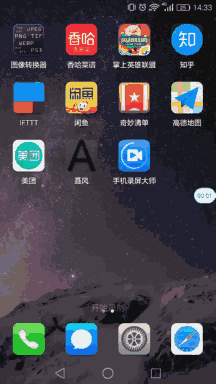

# cordova-create-react-app
一个cordova react例子,你可以使用它作为脚手架来创建你自己的APP，在安卓上测试通过。


# Hint:不建议你使用它来开发商业应用，cordova框架目前很难支持后台消息推送.



cordova-react-example包含以下组件

- React
- redux
- react-redux
- typestyle
- ant-design-mobile
- react-router4
- cordova
- cordova-plugin-x5-webview（腾旭X5内核）
- cordova-plugin-splashscreen（设置app启动画面的插件）

## 调试
```git clone https://github.com/assmdx/cordova-create-react-app.git ```
``` cd cordova-create-react-app ```

```npm run start ```

## 打包

```npm run build```

```cordova build android```


